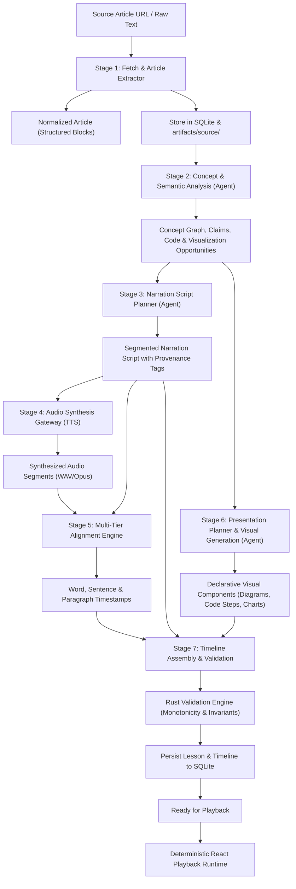
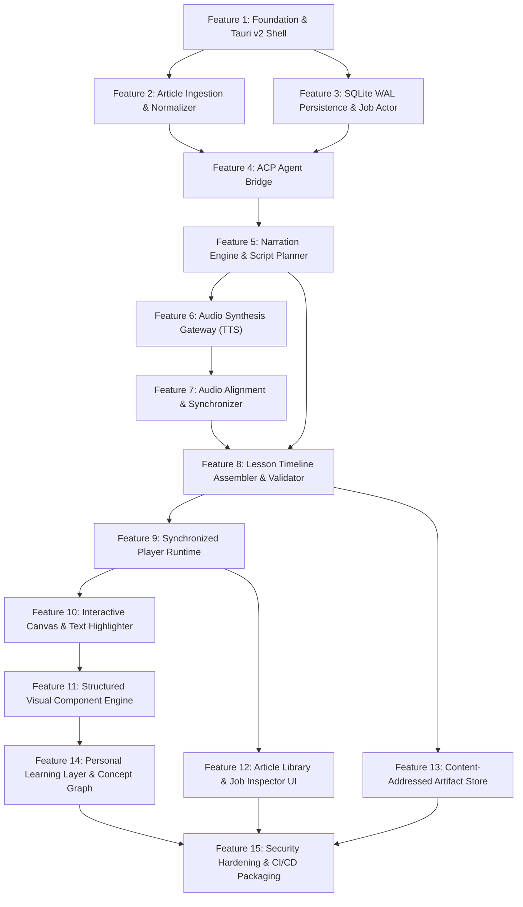

# Digest — System Architecture

> *Convert technical articles into synchronized, narrated, interactive learning presentations.*
>
> This is a **living document**. It describes the complete system architecture, data models, synchronization invariants, and component boundaries of Digest.

---

## Glossary

These terms have precise meanings throughout the documentation and codebase. Use them consistently.

| Term | Definition |
| :--- | :--- |
| **Normalized Article** | A clean, structural JSON/relational representation of an ingested article with identified sections, blocks, headings, code snippets, lists, tables, and metadata. |
| **Block** | The atomic content unit within an article section (e.g. paragraph, code block, quote, heading, image). |
| **Concept** | A structured idea or topic extracted during article analysis, including difficulty, source block mappings, and visualization suitability. |
| **Narration Segment** | A discrete spoken script unit generated by the agent, mapped to one or more source article blocks, with explicit fidelity tagging. |
| **Alignment Timing** | Time-coded mapping linking spoken audio to narration text at the paragraph, sentence, and word levels. |
| **Presentation Component** | A declarative visual or interactive widget (e.g. text highlight, code walkthrough, Mermaid/SVG diagram, chart, animation keyframe, concept card). |
| **Timeline** | A time-indexed sequence of synchronized narration segments and visual state transitions stored in SQLite and executed against the master audio clock. |
| **Lesson** | The complete compiled presentation entity comprising article metadata, audio tracks, timeline segments, and visual components. |
| **Playback Clock** | The deterministic master timekeeper driven by audio playback (`currentTime: f64`) that dictates all UI text scrolling, word highlights, and visual transitions. |
| **ACP (Agent Client Protocol)** | The protocol over which the Rust core communicates with external agent harnesses (Codex, Antigravity, Claude, custom local agents) to plan and compile presentations. |
| **Generation Job** | A durable, resumable background workflow tracking pipeline stages from ingestion through packaging. |
| **Provenance** | The verifiable link connecting any generated narration segment, explanation, diagram, or chart back to its source article blocks. |

---

## 1. System Overview & Core Invariants

Digest is a **local-first desktop presentation runtime powered by an agentic compilation pipeline**. The UI does not perform heavy computation or real-time LLM inference during playback; it executes a pre-compiled, deterministic lesson timeline queried from SQLite.

### The Cardinal Rule

> **The agent plans and compiles; Rust owns durable storage, job execution, and orchestration; React owns presentation and deterministic playback.**

The external agent (accessed via ACP) acts as an offline compiler that ingests raw article content, reasons over technical concepts, writes narration scripts, schedules visual demonstrations, and compiles everything into SQLite-persisted timeline models. Once compiled, playback is 100% deterministic, instant, and runs entirely offline without requiring an active agent session.

### Pipeline Data Flow

```
RAW URL / HTML ──► NORMALIZED ARTICLE ──► CONCEPT ANALYSIS ──► NARRATION SCRIPT
      │                      │                    │                   │
      ▼                      ▼                    ▼                   ▼
PERSISTED SOURCE       SOURCE BLOCKS       VISUAL PLAN       SYNTHESIZED AUDIO
      │                      │                    │                   │
      │                      └────────────┬───────┴───────────────────┘
      │                                   ▼
      └────────────────────────► COMPILED LESSON TIMELINE ◄── TIMINGS (WORD / SENTENCE)
                                          │
                                          ▼
                             DETERMINISTIC PLAYBACK RUNTIME
                        (Audio Clock + Text + Visual Canvas)
```

Every presentation component, narration line, and diagram maintains provenance links back to the original source blocks. The model proposes explanations; the application maintains source boundaries.

---

## 2. Architecture Topology

```mermaid
graph TB
    subgraph UI ["Desktop UI (React 19 + TypeScript Webview)"]
        PLAYER["Playback Engine & Master Clock"]
        CANVAS["Presentation Canvas (Text, Code, Diagrams, Charts)"]
        LIBRARY["Article Library & Reading History"]
        INSPECTOR["Generation Job Inspector & Progress Bar"]
    end

    subgraph CORE ["Rust Native Core (Tokio Async Runtime)"]
        IPC["Tauri Typed IPC Layer"]
        JOB_MGR["Generation Job State Machine"]
        DB_ACTOR["Database Writer Actor"]
        ART_MGR["Artifact & Content Store Manager"]
        ACP_CLIENT["ACP Client Bridge (Agent Orchestrator)"]
        AUDIO_GW["Audio Synthesis Gateway & Cache"]
        ALIGN_ENG["Timestamp Alignment Engine"]
        VALIDATOR["Timeline & Data Validator"]
    end

    subgraph PERSISTENCE ["SQLite WAL (digest.db)"]
        JOBS_TBL["Jobs & Stage Checkpoints"]
        ARTICLES_TBL["Articles, Sections & Blocks"]
        LESSONS_TBL["Lessons, Timeline Segments & Visuals"]
        HISTORY_TBL["Playback Progress & User Preferences"]
    end

    subgraph STORAGE ["Local Filesystem Store (artifacts/)"]
        RAW_STORE["Source HTML & Raw Content"]
        AUDIO_STORE["Synthesized Audio (WAV Chunks & Opus Streams)"]
        ASSET_STORE["Generated Visual Assets & SVG/Diagrams"]
    end

    subgraph AGENT ["External Agent Harness (via ACP)"]
        PROMPT["System Prompt & Pedagogy Rules"]
        SKILLS["Agent Skills (Ingest, Analyze, Script, Visualize)"]
        TOOLS["Agent Tool Registry (fetch, extract, tts, align)"]
    end

    subgraph PROVIDERS ["Pluggable External / Local Providers"]
        LOCAL_TTS["Local TTS Sidecar (Piper / Kokoro)"]
        CLOUD_TTS["Cloud TTS Gateway (OpenAI / ElevenLabs)"]
        EXTRACTOR["Readability / Headless Extractor"]
    end

    UI <-->|Tauri IPC (Typed Interfaces)| IPC
    IPC --> JOB_MGR
    IPC --> PLAYER
    PLAYER -.->|Reads Local Media| AUDIO_STORE
    PLAYER -.->|IPC Queries| DB_ACTOR

    JOB_MGR <--> DB_ACTOR
    DB_ACTOR --> PERSISTENCE
    JOB_MGR <--> ART_MGR
    ART_MGR --> STORAGE

    JOB_MGR <--> ACP_CLIENT
    ACP_CLIENT <-->|ACP Protocol (Stdio / WebSocket)| AGENT

    AGENT --> TOOLS
    TOOLS --> AUDIO_GW
    TOOLS --> ALIGN_ENG
    TOOLS --> EXTRACTOR

    AUDIO_GW --> LOCAL_TTS
    AUDIO_GW --> CLOUD_TTS
    JOB_MGR --> VALIDATOR
    VALIDATOR --> DB_ACTOR
```

---

## 3. Technology Decisions

| Layer | Technology | Why This Over Alternatives |
| :--- | :--- | :--- |
| **Desktop Shell** | **Tauri v2** | ~20 MB binary, ~60 MB RAM footprint. Native OS Webviews with strict capability-based IPC security. Electron was rejected due to 150 MB+ memory overhead and bundle bloat. |
| **Frontend** | **React 19 + TypeScript + Vite + TailwindCSS** | High velocity, component ecosystem, instant HMR inside the Tauri webview. Tailwind v4 for zero-config styling; custom Canvas/DOM renderers for 60 FPS playback. |
| **Core Engine** | **Rust (`tokio`, `rusqlite`, `reqwest`, `serde`)** | Safe concurrency, native I/O, subprocess supervision, memory safety, zero runtime overhead. Essential for job state management and audio pipeline orchestration. |
| **Persistence** | **SQLite (WAL Mode) via `rusqlite`** | Portable, single-file durable database. **Single Database Writer Actor** on Tokio MPSC channel eliminates `SQLITE_BUSY` lock contention; concurrent read handles for UI queries. |
| **Artifact Store** | **Content-Addressed Local Filesystem** | Audio files, raw source dumps, and cached chunks are indexed by SHA-256 hash or article ID under `artifacts/`, ensuring cacheability and atomic updates. |
| **Intelligence Layer** | **ACP (Agent Client Protocol)** | Standardized protocol decoupling the Tauri app from specific agent implementations. Supports Codex, Antigravity, Claude-based harnesses, or local agents interchangeably. |
| **Audio Synthesis** | **Pluggable TTS Engine** | Supports local zero-cost sidecars (Piper/Kokoro) for offline privacy and cloud APIs (ElevenLabs/OpenAI) for premium fidelity with unified audio chunk caching. |
| **Visual Engine** | **Declarative Structured Components** | Visuals are stored as structured JSON models in SQLite (Mermaid, SVG shapes, code tokens, chart series) rather than generated MP4/PNGs, enabling crisp scaling, theming, and low storage. |
| **Contracts** | **Hand-Maintained TypeScript & Rust Structs** | Written agreement in [contracts.md](contracts.md) mirrored in Rust and TypeScript without code generation complexity. |

---

## 4. End-to-End Pipeline



---

## 5. Key Architectural Patterns

### 5.1 Master Playback Clock & Synchronization Model

The audio playback clock is the single source of truth for the entire presentation runtime. The UI never polls an LLM during playback.

```
                    ┌─────────────────────────┐
                    │  HTML5 Audio Element    │
                    │  currentTime: 42.85s    │
                    └───────────┬─────────────┘
                                │ (60 FPS Animation Frame / timeupdate)
                                ▼
                    ┌─────────────────────────┐
                    │   Master Playback Clock │
                    └───────────┬─────────────┘
          ┌─────────────────────┼─────────────────────┐
          ▼                     ▼                     ▼
┌──────────────────┐  ┌──────────────────┐  ┌──────────────────┐
│ Active Segment   │  │ Active Word/Text │  │ Visual State     │
│ segment-03       │  │ Highlight word 48│  │ Step 2 in Code   │
│ (0:38 - 0:54)    │  │ Auto-scroll to L6│  │ Diagram Node #3  │
└──────────────────┘  └──────────────────┘  └──────────────────┘
```

At any point during playback or seeking:
1. `currentTime` resolves to the active timeline `segment` via binary search over segment time ranges $[start, end)$.
2. The segment resolves the active sentence and word from the alignment array.
3. The segment resolves the active presentation component and its internal visual keyframe/step.
4. Seeking is instant and O(log N) with zero audio/visual drift.

### 5.2 Agent-as-Planner vs Runtime-as-Player

- **The Agent is an offline compiler**: It takes messy human articles and produces structured timeline records in SQLite. It has access to tools (fetching, TTS, alignment, diagram generation) and operates asynchronously in the background.
- **The Tauri Runtime is a deterministic player**: It loads lesson records from SQLite, streams local audio files, and renders visual components strictly based on timestamp math. It has zero knowledge of prompts, LLM tokens, or network latency.

### 5.3 ACP Client & Agent Harness Bridge

The Rust core implements an ACP (Agent Client Protocol) client abstraction to communicate with the intelligence layer:

```rust
#[async_trait]
pub trait AgentProvider: Send + Sync {
    async fn start_session(&self, req: SessionRequest) -> Result<AgentSession, AppError>;
    async fn send_prompt(&self, session: &AgentSession, prompt: String) -> Result<AgentResponse, AppError>;
    async fn execute_skill(&self, session: &AgentSession, skill: &str, input: Value) -> Result<Value, AppError>;
    async fn cancel_session(&self, session: &AgentSession) -> Result<(), AppError>;
}
```

This ensures Digest can run with Codex, Antigravity, local LLM harnesses, or Claude-based CLI sidecars without changing application code.

### 5.4 Multi-Tier Audio Alignment & Degradation Chain

Audio alignment must never be a hard point of failure. The engine implements a progressive fallback hierarchy:

```
[ Tier 1: Word-Level Timestamps ]
   ├── High-precision TTS alignment (whisper/forced aligner)
   └── Word-by-word karaoke highlighting and exact code-line sync
         │ (If word alignment fails or is unsupported)
         ▼
[ Tier 2: Sentence-Level Timestamps ]
   ├── Punctuation-based sentence audio segmentation
   └── Sentence-level highlighting and smooth auto-scrolling
         │ (If sentence alignment fails)
         ▼
[ Tier 3: Paragraph-Level Timestamps ]
   ├── Section/block chunk audio durations
   └── Paragraph card highlighting
```

### 5.5 Structured Presentation Components over Raster Video

Unlike systems that render static MP4 video, Digest renders presentations using declarative web components:

```json
{
  "type": "diagram",
  "component": "flowchart",
  "props": {
    "engine": "mermaid",
    "source": "graph LR\n  Client --> API --> Database",
    "activeNode": "API"
  }
}
```

Advantages:
- **Instant seek**: No video decoding buffer or keyframe seek latency.
- **Minimal storage**: A 30-minute interactive lesson takes ~15 MB of Opus audio and < 100 KB in SQLite, compared to 500 MB+ for 1080p video.
- **Responsive & accessible**: Text in diagrams and code blocks remains selectable, copyable, and scales crisply to any screen DPI.
- **Themeable**: Automatically adapts to user dark/light theme preferences.

### 5.6 Tiered Database Commit Policy

| Data Type | Commit Policy | `PRAGMA synchronous` | Durability Guarantee |
| :--- | :--- | :--- | :--- |
| **Article Ingestion** | Single atomic transaction | `NORMAL` | Full article stored atomically |
| **Job State Transitions** | Immediate single commit | `FULL` | Survives power loss / crash |
| **Generation Checkpoints** | Per-stage atomic commit | `FULL` | Resumable after crash |
| **Playback History** | Debounced 2000 ms / on pause | `NORMAL` | Smooth playback; low disk I/O |

### 5.7 Source Fidelity & Attribution Invariant

To maintain educational integrity, the data model and UI strictly separate three types of content:
1. **Source Content**: Direct quotes, excerpts, and paragraphs written by the original author (tagged `origin: "source"`).
2. **AI Explanations**: Analogies, concept simplifications, and background context generated by the model (tagged `origin: "explanation"`).
3. **Supplementary Demonstrations**: Interactive animations, diagrams, or synthetic code walkthroughs (tagged `origin: "demonstration"`).

The presentation canvas clearly displays visual badges distinguishing author text from AI commentary.

---

## 6. Storage Model & Content-Addressed Artifacts

All persistent data is partitioned between SQLite WAL (structured metadata, articles, lessons, timeline segments, and jobs) and a filesystem artifact repository (raw HTML source and audio files):

```
~/.local/share/digest/ (or OS app-data directory)
|-- digest.db                # SQLite database (WAL mode)
|-- digest.db-wal
|-- digest.db-shm
`-- artifacts/
    `-- articles/
        `-- {article_id}/
            |-- source/
            |   `-- original.html        # Raw fetched HTML
            |-- audio/
            |   |-- segment-001.wav      # Intermediate audio chunks
            |   |-- segment-002.wav
            |   `-- master.opus          # Master concatenated audio stream
            `-- metadata.json            # Provenance hashes & generation config
```

---

## 7. Data Migration & Schema Evolution

- **Schema Versioning**: A `schema_migrations` table tracks applied migrations. On startup, the Rust backend runs pending SQL migrations inside a single transaction.
- **Additive Evolution**: Schemas evolve additively (new columns with default values, new tables) to prevent breaking existing stored articles.

---

## 8. Dependency Graph


