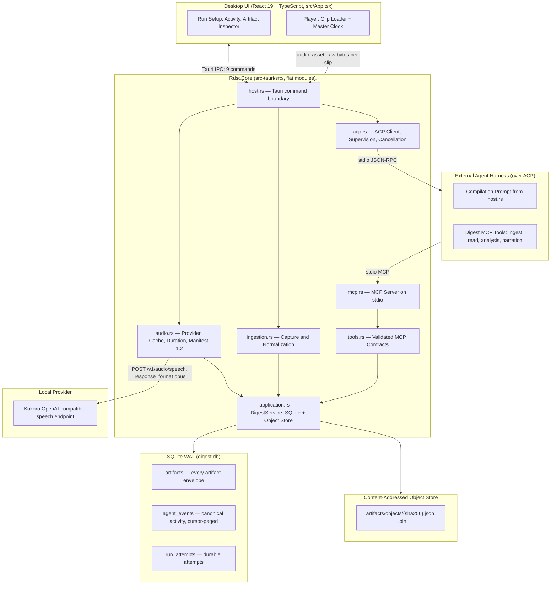
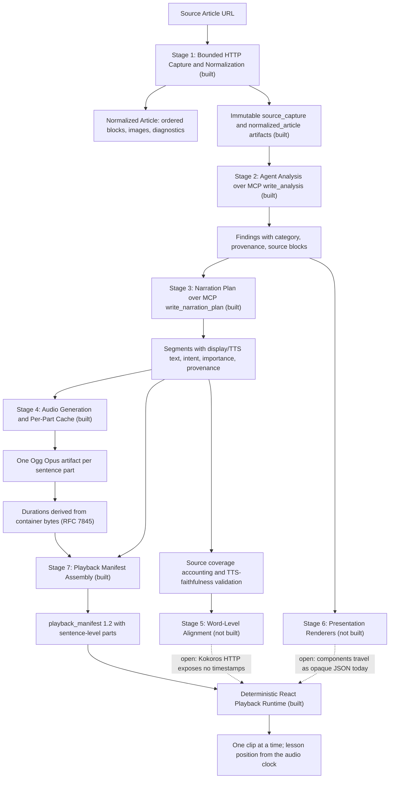
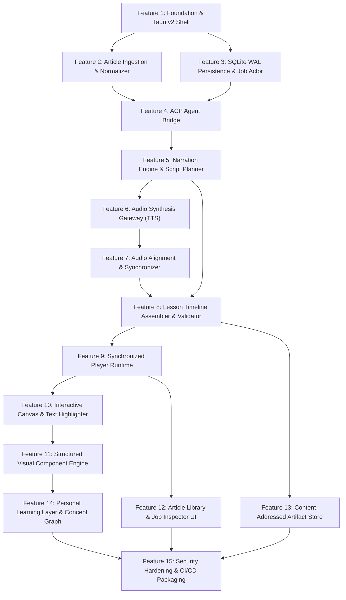

# Digest — System Architecture

> *Convert technical articles into synchronized, narrated, interactive learning presentations.*
>
> This is a **living document**. It describes the complete system architecture, data models, synchronization invariants, and component boundaries of Digest.
>
> **Status note.** This document mixes two things: the architecture as it exists at commit `3d99c32`, and the architecture the original plan described. Where the plan was not built, the section says so and names the file that exists instead. The Rust core is flat modules in `src-tauri/src/` — there is no `commands/`, `jobs/`, `storage/`, `artifacts/`, `validator/`, or `contracts/` directory. The frontend is a single-file React app (`src/App.tsx` plus `src/App.css`); there is no `src/player/`, `src/presentation/`, `src/features/`, `src/services/`, `src/mocks/`, or `src/types/contracts/`, and no Zustand or Tailwind build. Playback manifests are the only durable model; there is no `lessons` or `timeline_segments` table.

---

## Glossary

These terms have precise meanings throughout the documentation and codebase. Use them consistently.

| Term | Definition |
| :--- | :--- |
| **Normalized Article** | A clean, structural JSON representation of an ingested article: a flat ordered block list, image metadata, and extraction diagnostics. Persisted as a `normalized_article` artifact. |
| **Block** | The atomic content unit within an article (heading, paragraph, code, list, quote, or diagram). The article has no section tree; blocks are ordered and flat. |
| **Concept** | A structured idea extracted during article analysis. In the current model a concept is an `analysis` finding with a `category` and `sourceBlocks`; there is no separate concept graph or concept table. |
| **Narration Segment** | A discrete spoken script unit written by the agent through `write_narration_plan`, mapped to one or more source blocks, with explicit provenance, intent, and importance. |
| **Part** | A sentence-sized transport subdivision of one narration segment's `ttsText`, synthesized into its own audio artifact. The player seeks and regenerates at part granularity. |
| **Alignment Timing** | Time-coded mapping from spoken audio to narration text. Currently sentence-level, carried by the `parts[]` array of playback manifest `1.2`. Word-level timing is not implemented. |
| **Presentation Component** | A declarative visual description authored by the agent. Today it is opaque JSON passed through from the narration plan into the manifest unchanged; the renderers for its variants are not built. |
| **Playback Manifest** | The versioned contract between compilation and playback. Persisted as a `playback_manifest` artifact. It is the timeline. |
| **Lesson** | The compiled presentation entity: a playback manifest plus the audio artifacts it references. There is no `lessons` table; the manifest artifact is the lesson. |
| **Playback Clock** | The deterministic master timekeeper driven by audio playback (`currentTime: f64`) that dictates UI text scrolling, active-segment highlighting, and seeking. |
| **Clip** | One playable unit of audio in the player: a manifest part, or a whole segment for legacy manifests. The audio element holds exactly one clip at a time. |
| **ACP (Agent Client Protocol)** | The protocol over which the Rust core drives an external agent harness to plan and compile a lesson. OpenCode is the V1 provider; `agy` runs through an explicit adapter command. |
| **MCP** | The protocol over which the agent calls Digest's deterministic tools (`ingest_article`, `read_artifact`, `write_analysis`, `write_narration_plan`). |
| **Generation Job** | A durable workflow identified by `jobId`, tracking attempts, canonical activity, and artifacts. |
| **Provenance** | The verifiable link connecting any generated narration segment or explanation back to its source blocks, carried as a `ProvenanceKind`. |
| **Artifact** | Any durable, immutable, content-addressed output of a job, wrapped in an `ArtifactEnvelope` row. Audio bytes and images are stored by content hash on disk; their metadata is the artifact payload. |

---

## 1. System Overview & Core Invariants

Digest is a **local-first desktop presentation runtime driven by an agentic compilation pipeline**. The UI does not perform heavy computation or real-time LLM inference during playback; it executes a pre-compiled, deterministic lesson described by a playback manifest.

### The Cardinal Rule

> **The agent plans and compiles; Rust owns durable storage, job execution, and orchestration; React owns presentation and deterministic playback.**

The external agent (driven over ACP) acts as an offline compiler that reads the normalized article through Digest's MCP tools, writes the analysis and narration artifacts, and leaves audio generation to Digest. Once compiled, playback is deterministic and offline, and requires no active agent session.

### Pipeline Data Flow

```
RAW URL / HTML ──► NORMALIZED ARTICLE ──► ANALYSIS ──► NARRATION PLAN
      │                    │                   │               │
      ▼                    ▼                   ▼               ▼
SOURCE + ARTICLE       SOURCE BLOCKS        FINDINGS         SEGMENTS
ARTIFACTS              (stable IDs)     (with provenance)   (display/TTS text)
      │                    │                   │               │
      │                    └────────────┬──────┴───────────────┘
      │                                 ▼
      │                        AGENT SESSION EVENTS
      │                                 │
      │                                 ▼
      └────────────────────► PLAYBACK MANIFEST 1.2 ◄── DURATIONS (PER SENTENCE)
                                        │                (from container bytes)
                                        ▼
                           DETERMINISTIC PLAYBACK RUNTIME
                        (Audio Clock + Transcript + Player)
```

Every narration line maintains provenance links back to the original source blocks, and `write_narration_plan` refuses a plan that does not account for every block. The model proposes explanations; the application maintains source boundaries.

---

## 2. Architecture Topology


```mermaid
graph TB
    subgraph UI ["Desktop UI (React 19 + TypeScript, src/App.tsx)"]
        RUNVIEW["Run Setup, Activity, Artifact Inspector"]
        PLAYER["Player: Clip Loader + Master Clock"]
    end

    subgraph CORE ["Rust Core (src-tauri/src/, flat modules)"]
        HOST["host.rs — Tauri command boundary"]
        INGEST["ingestion.rs — Capture and Normalization"]
        APP["application.rs — DigestService: SQLite + Object Store"]
        ACP["acp.rs — ACP Client, Supervision, Cancellation"]
        TOOLS["tools.rs — Validated MCP Contracts"]
        AUDIO["audio.rs — Provider, Cache, Duration, Manifest 1.2"]
        MCPSRV["mcp.rs — MCP Server on stdio"]
    end

    subgraph PERSISTENCE ["SQLite WAL (digest.db)"]
        ART_TBL["artifacts — every artifact envelope"]
        EVT_TBL["agent_events — canonical activity, cursor-paged"]
        ATT_TBL["run_attempts — durable attempts"]
    end

    subgraph STORAGE ["Content-Addressed Object Store"]
        OBJECTS["artifacts/objects/{sha256}.json | .bin"]
    end

    subgraph AGENT ["External Agent Harness (over ACP)"]
        PROMPT["Compilation Prompt from host.rs"]
        MCPTOOLS["Digest MCP Tools: ingest, read, analysis, narration"]
    end

    subgraph PROVIDERS ["Local Provider"]
        KOKORO["Kokoro OpenAI-compatible speech endpoint"]
    end

    UI <-->|Tauri IPC: 9 commands| HOST
    HOST --> INGEST
    HOST --> ACP
    HOST --> AUDIO
    ACP -->|stdio JSON-RPC| AGENT
    AGENT -->|stdio MCP| MCPSRV
    MCPSRV --> TOOLS
    TOOLS --> APP
    INGEST --> APP
    AUDIO --> APP
    AUDIO -->|POST /v1/audio/speech, response_format opus| KOKORO
    APP --> PERSISTENCE
    APP --> STORAGE
    PLAYER -.->|audio_asset: raw bytes per clip| HOST
```

The database has three tables: `artifacts`, `agent_events`, and `run_attempts`. There are no `articles`, `sections`, `blocks`, `lessons`, `timeline_segments`, or `playback_history` tables — article and lesson state live as immutable JSON payloads in the `artifacts` table.

---

## 3. Technology Decisions

| Layer | Technology | Why This Over Alternatives |
| :--- | :--- | :--- |
| **Desktop Shell** | **Tauri v2** | Small binary, low memory footprint. Native OS webviews with capability-based IPC security. Electron was rejected for its bundled Chromium and much larger memory overhead. |
| **Frontend** | **React 19 + TypeScript + Vite** | High velocity and a mature ecosystem inside the Tauri webview. Styling is hand-written CSS in `src/App.css`. Tailwind was planned and not adopted: there is no Tailwind build, and the app is a single component file. |
| **Core Engine** | **Rust (`tokio`, `rusqlite`, `reqwest`, `serde`, `rmcp`, `schemars`)** | Safe concurrency, native I/O, subprocess supervision, and memory safety. Needed for agent process supervision and the audio pipeline. |
| **Persistence** | **SQLite (WAL Mode) via `rusqlite`** | Portable, single-file durable database. `DigestService` opens a connection per operation rather than running a writer actor; `PRAGMA journal_mode = WAL` and `PRAGMA foreign_keys = ON` are set at startup. |
| **Artifact Store** | **Content-Addressed Local Filesystem** | Raw captures, JSON payloads, images, and audio are written to `artifacts/objects/{sha256}.{json,bin}` via a temp-file write plus atomic rename. Identical bytes are stored once. |
| **Intelligence Layer** | **ACP (Agent Client Protocol) over stdio** | Decouples the app from a specific agent implementation. OpenCode runs its native `opencode acp` server; `agy` runs through an explicit adapter command. |
| **Tool Layer** | **MCP over stdio** | The agent reaches Digest's validated, deterministic services over MCP (`rmcp`). ACP is in front of the agent; MCP is behind it. |
| **Audio Synthesis** | **Provider-neutral `AudioProvider` trait; Kokoro as the primary implementation** | Any provider works if it delivers a container Digest can time. Kokoro is local, free, and offline; its OpenAI-compatible endpoint delivers Ogg Opus. |
| **Durable Audio Format** | **Ogg Opus, one artifact per sentence** | Replaces the originally planned concatenated `master.opus`. A 29-minute lesson was 158.9 MiB of float32 WAV; the Opus path is projected at roughly a tenth of that and is not yet measured on a full lesson. It also makes one sentence re-synthesizable without re-encoding the lesson. See [D-012](decisions.md#d-012--durable-audio-per-sentence-ogg-opus-artifacts-over-a-concatenated-master-stream). |
| **Visual Engine** | **Declarative Structured Components** | Visuals travel as structured JSON in the narration plan and the manifest rather than as rendered video, which keeps seeking instant and text selectable. The per-type renderers are not built yet. |
| **Contracts** | **Hand-Maintained TypeScript & Rust Structs** | Written agreement in [contracts.md](contracts.md) mirrored in Rust and TypeScript without code generation complexity. |

---

## 4. End-to-End Pipeline

The end-to-end pipeline, with the stage that is built at commit `3d99c32` marked.


```mermaid
flowchart TD
    URL["Source Article URL"] --> STAGE1["Stage 1: Bounded HTTP Capture and Normalization (built)"]
    STAGE1 --> NORM["Normalized Article: ordered blocks, images, diagnostics"]
    STAGE1 --> STORE_SRC["Immutable source_capture and normalized_article artifacts (built)"]

    STORE_SRC --> STAGE2["Stage 2: Agent Analysis over MCP write_analysis (built)"]
    STAGE2 --> CONCEPTS["Findings with category, provenance, source blocks"]

    CONCEPTS --> STAGE3["Stage 3: Narration Plan over MCP write_narration_plan (built)"]
    STAGE3 --> SCRIPT["Segments with display/TTS text, intent, importance, provenance"]
    SCRIPT --> COVERAGE["Source coverage accounting and TTS-faithfulness validation"]

    SCRIPT --> STAGE4["Stage 4: Audio Generation and Per-Part Cache (built)"]
    STAGE4 --> AUDIO["One Ogg Opus artifact per sentence part"]
    AUDIO --> DUR["Durations derived from container bytes (RFC 7845)"]

    DUR --> STAGE7["Stage 7: Playback Manifest Assembly (built)"]
    SCRIPT --> STAGE7
    STAGE7 --> MANIFEST["playback_manifest 1.2 with sentence-level parts"]

    MANIFEST --> RUNTIME["Deterministic React Playback Runtime (built)"]
    RUNTIME --> CLOCK["One clip at a time; lesson position from the audio clock"]

    COVERAGE --> ALIGN["Stage 5: Word-Level Alignment (not built)"]
    ALIGN -.->|open: Kokoros HTTP exposes no timestamps| RUNTIME

    CONCEPTS --> STAGE6["Stage 6: Presentation Renderers (not built)"]
    STAGE6 -.->|open: components travel as opaque JSON today| RUNTIME
```

Stages 5 and 6 are the two remaining gaps in the runtime path. Word-level timing is blocked on the provider rather than on the design: Kokoros documents a timestamped ONNX model and TSV sidecars, but only for its CLI, so word alignment needs either an HTTP extension upstream or a CLI-based provider. Stage 6's structured components already reach the manifest as opaque JSON; what is missing is the renderer that draws them against the audio clock.

---

## 5. Key Architectural Patterns

### 5.1 Master Playback Clock & Synchronization Model

The audio playback clock is the single source of truth. The UI never polls an LLM during playback.

The player does not stream one continuous lesson track. It loads **one clip at a time** into a single `<audio>` element. The lesson clock spans the whole manifest; the audio element's `currentTime` is relative to whichever clip is loaded. Lesson position is therefore the current clip's `startMs` plus the element's `currentTime` in seconds:

```
 manifest.segments ──normalize──► flat clips[]  (one per sentence part)
                                        │
                                        ▼
                    ┌────────────────────────────────┐
                    │  HTML5 Audio Element           │
                    │  currentTime: 12.85s           │
                    │  holding clip art-7 (0:11.9-0:19.4)  │
                    └───────────────┬────────────────┘
                                    │ + clip.startMs
                                    ▼
                    ┌────────────────────────────────┐
                    │   Lesson position: 24.75s      │
                    └───────────────┬────────────────┘
        ┌───────────────────────────┼───────────────────────────┐
        ▼                           ▼                           ▼
┌───────────────┐          ┌──────────────────┐         ┌──────────────────┐
│ Active clip   │          │ Active segment   │         │ Transcript       │
│ art-7         │          │ s-1 (via         │         │ auto-scroll to   │
│ sentence 2/3  │          │ segmentIndex)    │         │ the active line  │
└───────────────┘          └──────────────────┘         └──────────────────┘
```

At any point during playback or seeking:

1. `manifest.segments.flatMap(...)` normalizes 1.0/1.1/1.2 into one flat clip list once, on manifest change. A 1.2 segment contributes one clip per part; a 1.0/1.1 segment contributes exactly one clip carrying the segment's own bounds and artifact.
2. Lesson position resolves to the active clip by index and, within a 1.2 segment, to the active part by scanning `parts[]` for the part whose `[startMs, endMs)` contains the position.
3. The clip's `segmentIndex` resolves the owning segment, which is what the transcript, the provenance display, and the regenerate control read.
4. Seeking to a lesson position is a two-step operation: set `pendingSeek` to the offset within the target clip, and let the element load that clip. Playback state is never inferred from a timer.

**Not implemented:** word-level highlighting. There is no word timing in any manifest schema, so the finest granularity the player can resolve is a sentence part.

### 5.2 Agent-as-Planner vs Runtime-as-Player

- **The agent is an offline compiler**: It reads the normalized article through `read_artifact`, then writes `write_analysis` and `write_narration_plan`. Those tool calls are validated by `tools.rs` before anything is persisted.
- **The Tauri runtime is a deterministic player**: It loads the playback manifest artifact, fetches audio bytes per clip over `audio_asset`, and derives every visible state from timestamp math. It has zero knowledge of prompts, model tokens, or network latency.

The division is enforced, not just intended: the player reads the manifest artifact and the audio artifacts and calls no command that starts or talks to an agent.

### 5.3 ACP Client & Agent Harness Bridge

ACP is the client-to-agent control channel. `AgentProvider` is an enum carrying launch information, not a trait with a session API:

```rust
#[serde(tag = "provider", rename_all = "snake_case")]
pub enum AgentProvider {
    OpenCode,
    Agy { adapter_command: String, adapter_args: Vec<String> },
}
```

`acp.rs` implements the client directly over stdio JSON-RPC: subprocess spawn, initialize, session creation, capability negotiation, permission handling, canonical event projection, cooperative cancellation, and inactivity supervision. `McpLaunchSpec` is passed to the session so the agent starts `digest-mcp` and calls Digest's tools.

Capability negotiation is real at the protocol level, but there is no separate `AgentDriver` trait with a `capabilities()` method as proposed in [research-agent-ingestion-runtime.md §1.6](research-agent-ingestion-runtime.md#16-proposed-agent-contract). Adding Codex, Claude Code, or a local harness means adding an `AgentProvider` variant and, where the CLI is not ACP-native, an adapter.

### 5.4 Audio Alignment & Degradation Chain

Audio alignment must never be a hard point of failure. The engine implements a progressive fallback hierarchy:

```
[ Tier 1: Word-Level Timestamps ] -- NOT BUILT
   |
   | (no word timing available from the provider)
   v
[ Tier 2: Sentence-Level Timestamps ] -- BUILT
   |  split_into_sentence_parts() at . ! ? plus trailing quotes,
   |  short fragments merged; one audio artifact and one
   |  startMs/endMs pair per part in manifest 1.2
   v
[ Tier 3: Segment-Level Bounds ] -- BUILT
   |  segment startMs/endMs span the aggregate bounds of its parts
   v
[ Tier 4: Lesson Duration ] -- BUILT
      audio.durationMs is the sum of every part duration
```

Tier 1 is blocked, not skipped. Kokoros documents a timestamped ONNX model and TSV sidecars, but exposes them only through its CLI; its HTTP endpoint returns audio and no timings. Until a provider surfaces word timings, the player resolves granularity to a sentence.

Durations at every tier are derived by Digest from the durable container bytes, never from a provider-reported header. Ogg Opus durations come from the RFC 7845 granule position minus the `OpusHead` pre-skip at 48 kHz, and a format Digest cannot time is rejected before anything is persisted.

### 5.5 Structured Presentation Components over Raster Video

Unlike systems that render static MP4 video, Digest carries visual intent as declarative JSON rather than rendered frames:

```json
{
  "type": "article-text",
  "blockIds": ["block-1"]
}
```

`presentation` is authored by the agent in `NarrationSegmentDraft.presentationType`, validated against the `PresentationType` enum, and passed through the narration plan into the manifest's segment unchanged. The frontend currently reads only `presentation.type` for display. The per-type renderers — Mermaid diagrams, code walkthroughs, charts — are not built.

Advantages that still hold:
- **Instant seek**: No video decoding buffer or keyframe seek latency. A seek is a manifest lookup plus one artifact fetch.
- **Minimal storage**: a 29-minute lesson was 158.9 MiB as float32 WAV. The Opus path is projected at roughly a tenth of that but has not been measured end to end on a full lesson; re-measure rather than quote a projection.
- **Responsive & accessible**: Text in diagrams and code blocks remains selectable, copyable, and scales crisply to any screen DPI.
- **Themeable**: The surface reads from CSS custom properties.

### 5.6 Commit Policy and Durability

| Data Type | Commit Policy | Durability Guarantee |
| :--- | :--- | :--- |
| **JSON artifact** | Content-addressed temp file, `fsync`, atomic rename, then one row insert | The object exists before the row references it |
| **Binary artifact** (audio, image) | Same as JSON, into `{sha256}.bin` | Identical bytes are written once and shared |
| **Agent event** | One insert per canonical event, monotonically sequenced | Ordered history survives crash |
| **Run attempt** | Insert on start, update on terminal status | A run interrupted by a killed process is recovered to `failed` at host startup |
| **Audio generation** | Every completed part is persisted immediately; the manifest is written only after the last part | Cancellation or provider failure leaves completed parts cached and commits no partial manifest |

There is no `PRAGMA synchronous` tuning table and no debounced playback-history write, because neither exists. The `artifacts` table has no `created_at_ms` index and no FTS; `list_artifacts` orders by `rowid`, which is insertion order, and that ordering is load-bearing — see [D-014](decisions.md#d-014--newest-artifact-wins-cache-resolution).

### 5.7 Source Fidelity & Attribution Invariant

To maintain educational integrity, the data model and UI strictly separate what the source said from what the model added. `ProvenanceKind` is the vocabulary, and it is enforced on the MCP tool arguments:

| `ProvenanceKind` | Meaning |
| :--- | :--- |
| `source_derived` | The source states this. |
| `ai_explanation` | The model explains or restates, adding no new claim. |
| `ai_inference` | The model inferred this; it is not in the source. |
| `generated_educational` | The model generated teaching scaffolding. |

Every analysis finding and every narration segment carries one. `write_narration_plan` additionally requires every source block to be explicitly taught, summarized, or skipped with a rationale, requires every taught or summarized block to be cited by a segment, and validates that `ttsText` differs from `displayText` only by pronunciation normalization — it rejects a TTS text that adds or drops content.

---

## 6. Storage Model & Content-Addressed Artifacts

All persistent data is partitioned between SQLite WAL (artifact envelopes, agent events, run attempts) and a content-addressed object store on the filesystem.

The data directory is the OS app-data directory, `$HOME/.local/share/com.bhondu.digest` on Linux. `DigestService::open` creates the layout:

```
<data_dir>/                             # $HOME/.local/share/com.bhondu.digest
|-- digest.db                          # SQLite (WAL mode)
|-- digest.db-wal
|-- digest.db-shm
`-- artifacts/
    `-- objects/
        |-- {sha256}.json              # every JSON payload, and the raw source capture
        |-- {sha256}.bin               # audio segments and localized images
        `-- .{sha256}.{pid}.{n}.tmp    # in-flight write, renamed or removed
```

There is no per-article directory, no `source/` or `audio/` subdirectory, no `master.opus`, and no `metadata.json`. The `artifacts` row carries `content_hash`, which is the join key to the object store:

| Table | Columns |
| :--- | :--- |
| `artifacts` | `artifact_id` (PK), `schema_version`, `job_id`, `kind`, `content_hash`, `created_at_ms`, `payload_json` |
| `agent_events` | `sequence` (PK, autoincrement), `job_id`, `session_id`, `kind`, `message`, `created_at_ms` |
| `run_attempts` | `attempt_id` (unique), `job_id`, `provider`, `provider_session_id`, `status`, `started_at_ms`, `finished_at_ms`, `error` |

`read_binary_artifact` refuses any kind other than `audio_segment` or `image_asset`, so a manifest ID cannot be dereferenced as media.

Writes are content-addressed, so identical bytes are stored once and a re-run that produces the same narration plan reuses the same object. Deleting a job's rows does not delete objects: there is no garbage collector and no reference counting.

---

## 7. Schema Evolution

- **No migration table**: there is no `schema_migrations` table and no versioned migration runner. `initialize_database` issues `CREATE TABLE IF NOT EXISTS` DDL on every open, so a new table is added by adding DDL there.
- **Additive only, by convention**: `DigestError::InvalidInput` rejects an unrecognized `artifact.kind` at parse time, and `AgentEvent.kind` parsing rejects an unknown event kind, so an older binary will not silently misread a newer row. Adding a *column* is the risky direction, since an older binary selects an explicit column list and will not tolerate one it does not know.
- **Payload versions are separate from envelope versions**: every artifact envelope is `schema_version = "1.0"`. Individual payload shapes carry their own `schemaVersion` and are versioned independently: normalized article `1.2`, audio segment `1.1`, playback manifest `1.2`.

---

## 8. Dependency Graph


```mermaid
graph TD
    F1["Feature 1: Foundation & Tauri v2 Shell"] --> F2["Feature 2: Article Ingestion & Normalizer"]
    F1 --> F3["Feature 3: SQLite WAL Persistence & Job Actor"]

    F2 --> F4["Feature 4: ACP Agent Bridge"]
    F3 --> F4

    F4 --> F5["Feature 5: Narration Engine & Script Planner"]
    F5 --> F6["Feature 6: Audio Synthesis Gateway (TTS)"]
    F6 --> F7["Feature 7: Audio Alignment & Synchronizer"]

    F7 --> F8["Feature 8: Lesson Timeline Assembler & Validator"]
    F5 --> F8

    F8 --> F9["Feature 9: Synchronized Player Runtime"]
    F9 --> F10["Feature 10: Interactive Canvas & Text Highlighter"]
    F10 --> F11["Feature 11: Structured Visual Component Engine"]

    F9 --> F12["Feature 12: Article Library & Job Inspector UI"]
    F8 --> F13["Feature 13: Content-Addressed Artifact Store"]

    F11 --> F14["Feature 14: Personal Learning Layer & Concept Graph"]
    F12 --> F15["Feature 15: Security Hardening & CI/CD Packaging"]
    F13 --> F15
    F14 --> F15
```

Feature-by-feature status against the code is tracked in [milestones.md](milestones.md). At commit `3d99c32`: Features 1 and 6 are complete; 2, 3, 4, 5, 7, 9, 12, and 13 are partial; 8, 10, 11, 14, and 15 are not started.
