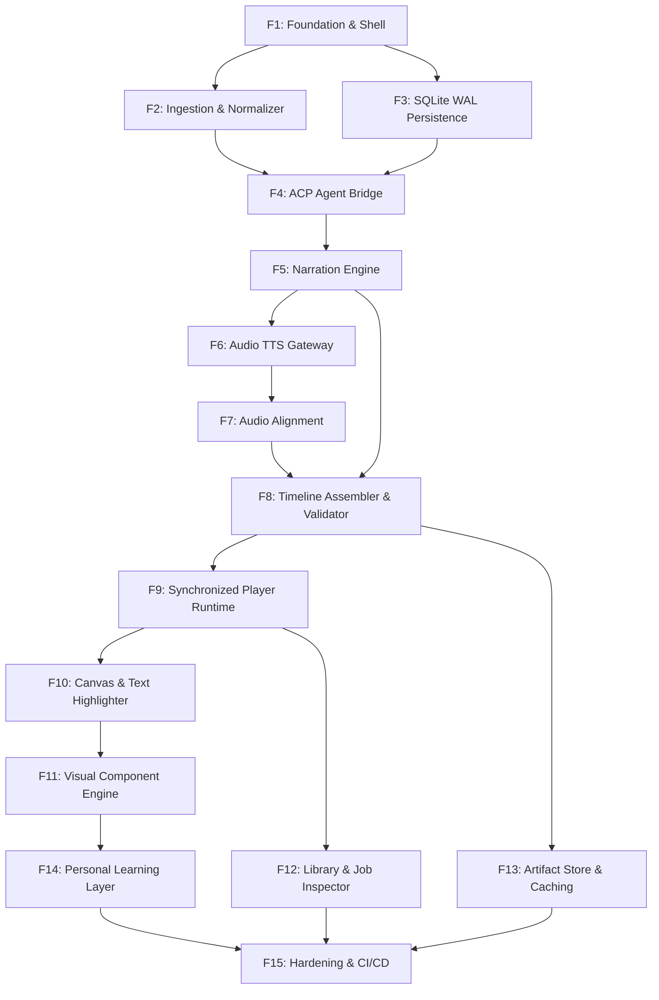

# Digest — Master Roadmap

> Full project build order for a single developer. This document is the **single canonical roadmap** describing **what** needs to be built, **why**, **which files to touch**, and **how to verify**, in strict dependency order.
>
> For system architecture, see [System Architecture](architecture.md). For IPC and data types, see [Shared Contracts](contracts.md).

---

## Progress Tracker

```
[ ] Feature 1  — Foundation & Tauri v2 Shell                          (Sprint 1)
[ ] Feature 2  — Article Ingestion & Content Normalizer               (Sprint 1)
[ ] Feature 3  — SQLite WAL Persistence & Job State Machine           (Sprint 1)
[ ] Feature 4  — ACP Agent Bridge & Communication Layer               (Sprint 2)
[ ] Feature 5  — Narration Planner & Script Engine                    (Sprint 2)
[ ] Feature 6  — Audio Generation & Pluggable TTS Gateway             (Sprint 2)
[ ] Feature 7  — Audio Alignment & Timestamp Synchronizer             (Sprint 2)
[ ] Feature 8  — Lesson Timeline Assembler & Validator                (Sprint 3)
[ ] Feature 9  — Synchronized Player Runtime & Master Clock           (Sprint 3)
[ ] Feature 10 — Interactive Reading Canvas & Text Highlighter        (Sprint 3)
[ ] Feature 11 — Structured Visual Component Engine                   (Sprint 4)
[ ] Feature 12 — Article Library & Job Progress Inspector             (Sprint 4)
[ ] Feature 13 — Content-Addressed Artifact Store & Cache Manager     (Sprint 4)
[ ] Feature 14 — Personal Learning Layer & Concept Graph (V3)         (Sprint 5)
[ ] Feature 15 — Security Hardening, Packaging & Multi-Platform CI/CD (Sprint 5)
```

---

## Dependency Graph

Features are ordered so that each feature's inputs are produced by the features above it.



---

## Waterfall Decisions (Made Once, Inherited by Everything)

These architectural choices are documented in [System Architecture](architecture.md) and recorded ADR-style in the [Decision Log](decisions.md).

| Decision | Choice | Main Alternative Rejected | Rationale |
| :--- | :--- | :--- | :--- |
| **Desktop Shell** | Tauri v2 | Electron | ~20 MB binary vs 150 MB+; native OS Webview; strict capability security |
| **Core Engine** | Rust (Tokio) | Node.js, Python | Native process supervision, zero-runtime async engine, safe memory model |
| **Frontend** | React 19 + TypeScript + Vite | Svelte, Vue | Rich ecosystem for syntax highlighting, charts, and media player controls |
| **Persistence** | SQLite WAL + Single Writer Actor | PostgreSQL, IndexedDB | Single-file, durable across restarts, zero lock contention |
| **Execution Model** | Offline Agent Compiler + Deterministic Player | Real-time Streaming LLM | Deterministic seeking, 100% offline playback, zero token cost on replay |
| **Master Clock** | Audio Element `currentTime` | Independent JS Timers | Single source of truth; eliminates audio/visual drift |
| **Visual Engine** | Structured SVG/Canvas/DOM Components | Generative MP4 Video | Instant seek, < 20 MB storage, crisp high-DPI scaling, selectable code |
| **Intelligence Bridge**| ACP (Agent Client Protocol) | Direct Vendor LLM API | Model-agnostic; supports Codex, Antigravity, Claude, and local agents |

---

## Feature 1 — Foundation & Tauri v2 Shell

### The Problem

Every subsequent feature requires a running desktop application with two-way communication between a React frontend and a Rust backend, with a clean layout and capability permissions configured.

### Key Files to Touch / Create

- `src-tauri/tauri.conf.json` — Window dimensions, frameless mode, title
- `src-tauri/capabilities/default.json` — Security capability allowlist
- `src-tauri/src/main.rs` — Initialize Tokio multi-threaded runtime
- `src-tauri/src/contracts/error.rs` — Typed `AppError` enum using `thiserror`
- `src-tauri/src/lib.rs` — Register `ping` command
- `src/services/api.ts` — Frontend typed IPC bridge with mock fallback
- `src/App.tsx` — Desktop layout shell (Titlebar, Viewport, Sidebar)

### Requirements

- Tauri v2 project structure configured and building cleanly
- Async Tokio multi-threaded runtime configured in Rust `main.rs`
- At least one round-trip typed IPC command (`ping -> pong`)
- Custom frameless titlebar with window dragging, minimize, maximize, and close
- React 19 + TypeScript + Vite + TailwindCSS hot-reloading in the webview
- Global error enum (`AppError`) in Rust with `serde::Serialize` for typed IPC errors

### Alternatives to Consider

| Choice | Option A | Option B |
| :--- | :--- | :--- |
| Window frame | Native OS window chrome (zero effort) | Custom frameless titlebar (more polished, uniform styling) |
| Styling engine | Tailwind v4 (CSS-first, zero config) | Vanilla CSS Modules (more boilerplate) |

### Verification

- `pnpm tauri dev` launches the desktop window with hot module replacement
- `invoke("ping")` from React console returns `{ message: "pong", version: "0.1.0" }`
- Custom titlebar drag, minimize, maximize, and close buttons work reliably

---

## Feature 2 — Article Ingestion & Content Normalizer

### The Problem

Web articles come from messy HTML with ads, cookie banners, navigation bars, and varied markup. We must extract readable article text, preserve headings, code blocks, lists, and metadata, and emit a clean `NormalizedArticle` structure into SQLite.

### Key Files to Touch / Create

- `src-tauri/src/extractor/fetcher.rs` — HTTP fetcher with redirect and timeout handling via `reqwest`
- `src-tauri/src/extractor/readability.rs` — Readability DOM content sanitizer
- `src-tauri/src/extractor/parser.rs` — Structural AST block parser (headings, code, lists, callouts)
- `src-tauri/src/contracts/article.rs` — `NormalizedArticle`, `ArticleSection`, `ArticleBlock` structs
- `src-tauri/src/commands/ingest.rs` — `ingest_url` IPC command handler

### Requirements

- Accept HTTP/HTTPS URLs or raw Markdown/HTML
- Fetch webpage content with redirect handling and timeout protection
- Clean HTML boilerplates (scripts, styles, ads, navbars) using a readability algorithm
- Extract title, author, publication date, and source URL
- Parse and preserve section hierarchy (`h1` - `h6`)
- Distinguish blocks: paragraphs, code snippets (with language), blockquotes, lists, tables, callouts
- Compute word count and estimated read time
- Emit strongly-typed `NormalizedArticle` struct

### Edge Cases to Handle

| Edge Case | Behavior |
| :--- | :--- |
| Paywalled or 403 Forbidden page | Return `AppError::Extractor("Content access restricted")` |
| Malformed HTML / unclosed tags | Robust HTML5 parser recovery (e.g. `html5ever`) |
| Code block with no language specified | Auto-detect or default to `"text"` |
| Page with no identifiable title | Fallback to URL path or `<title>` meta tag |

### Verification

- Ingest 5 diverse technical articles (e.g. blog posts with Rust code, documentation pages, multi-section essays)
- Generates clean `NormalizedArticle` with 0 missing paragraphs or broken code blocks
- Normalization completes in < 1.5 seconds per article

---

## Feature 3 — SQLite WAL Persistence & Job State Machine

### The Problem

Article contents, normalized structures, generation jobs, and playback progress must survive app crashes and restarts. Multi-stage generation requires a robust background job state machine that never locks the UI or SQLite database.

### Key Files to Touch / Create

- `src-tauri/src/storage/db.rs` — SQLite connection pool and WAL mode initializers
- `src-tauri/src/storage/migrations/001_initial.sql` — Schema definition for articles, sections, blocks, lessons, timeline segments, jobs
- `src-tauri/src/storage/actor.rs` — `DbWriterActor` task over Tokio MPSC channel
- `src-tauri/src/jobs/manager.rs` — Job lifecycle state machine and checkpoint manager
- `src-tauri/src/commands/jobs.rs` — IPC queries for job state

### Requirements

- SQLite in WAL mode with a dedicated Database Writer Actor consuming a Tokio MPSC channel
- Independent read connections for UI queries to eliminate `SQLITE_BUSY` contention
- Tables for `articles`, `sections`, `blocks`, `lessons`, `timeline_segments`, `jobs`, `playback_history`
- Generation job state machine supporting stages: `queued`, `fetching`, `extracting`, `analyzing`, `scripting`, `synthesizing_audio`, `aligning`, `planning_visuals`, `assembling_timeline`, `validating`, `ready`, `failed`
- Startup crash recovery: mark incomplete `running` jobs as `failed` / `resumable`
- Schema migration system with `schema_migrations` table

### Verification

- Concurrently spawn 10 background tasks writing records: 0 lock errors, 100% committed rows
- Force-kill the app during active processing, restart: incomplete jobs detected and recovered
- Read queries execute during active batch writes without blocking

---

## Feature 4 — ACP Agent Bridge & Communication Layer

### The Problem

Digest delegates content analysis, narration planning, and visualization planning to an external AI agent. We need a standardized, pluggable ACP (Agent Client Protocol) communication bridge in Rust that connects to agent harnesses (Codex, Antigravity, custom local agents).

### Key Files to Touch / Create

- `src-tauri/src/acp/traits.rs` — `AgentProvider` async trait definition
- `src-tauri/src/acp/client.rs` — Stdio subprocess transport & JSON-RPC framing
- `src-tauri/src/acp/session.rs` — Session lifecycle, skill dispatcher, timeout management
- `src-tauri/src/contracts/acp.rs` — `AgentSession`, `SkillInvocation`, `SessionRequest`
- `src-tauri/src/contracts/concepts.rs` — `ConceptAnalysis`, `ConceptItem`, `VisualizationOpportunity`

### Requirements

- Implement `AgentProvider` async trait in Rust
- Support stdio subprocess transport and WebSocket/HTTP transports
- Manage agent session lifecycles: `start_session`, `send_prompt`, `execute_skill`, `cancel_session`
- Structured skill request/response framing with typed payload validation
- Timeout handling and cancellation support
- Session logging for inspection and debugging

### Verification

- Successfully starts an ACP session with the agent harness
- Dispatches a test analysis request and receives a valid structured response
- Gracefully handles agent subprocess crashes and timeouts

---

## Feature 5 — Narration Planner & Script Engine

### The Problem

Direct text-to-speech on a raw article sounds dry and unnatural. The narration engine must convert technical prose into engaging, conversational spoken scripts while maintaining strict source fidelity and clear attribution.

### Key Files to Touch / Create

- `src-tauri/src/narration/prompts.rs` — Prompt templates for Faithful, Explained, Deep Dive, Executive modes
- `src-tauri/src/narration/planner.rs` — Narration planner orchestrator
- `src-tauri/src/narration/validator.rs` — Provenance validator checking proposed block IDs
- `src-tauri/src/contracts/narration.rs` — `NarrationPlan`, `NarrationSegment`

### Requirements

- Support 4 narration modes: Faithful, Explained (default), Deep Dive, Executive
- Generate segmented spoken scripts mapped to source `ArticleBlock` IDs
- Strict attribution tags on every segment: `origin: "source" | "explanation" | "demonstration"`
- Insert visual cues and pronunciation hints for technical terms (e.g. `SQL`, `OAuth`, `Kubernetes`)
- Segment script into small timeable chunks (10-30 seconds each) suitable for audio synthesis

### Verification

- Generates coherent, natural-sounding scripts for complex technical topics
- 100% of generated segments cite valid source block IDs
- Explanation and source sentences are correctly distinguished in the data model

---

## Feature 6 — Audio Generation & Pluggable TTS Gateway

### The Problem

Audio synthesis must work across different user hardware setups: offline local TTS sidecars for privacy and zero cost, or cloud TTS APIs for studio-quality voices.

### Key Files to Touch / Create

- `src-tauri/src/audio/gateway.rs` — Unified TTS gateway & provider dispatcher
- `src-tauri/src/audio/providers/local_tts.rs` — Local TTS sidecar runner (Piper / Kokoro)
- `src-tauri/src/audio/providers/cloud_tts.rs` — Cloud TTS client (OpenAI / ElevenLabs)
- `src-tauri/src/audio/cache.rs` — SHA-256 hash-based audio chunk cache
- `src-tauri/src/audio/encoder.rs` — Concatenation and master Opus encoder
- `src-tauri/src/contracts/audio.rs` — `AudioArtifact`, `MasterAudioTrack`, `TTSProviderConfig`

### Requirements

- Pluggable `TTSProvider` trait: `generate_audio(text, voice, config) -> Result<AudioArtifact>`
- Local TTS provider support (e.g. Piper / Kokoro ONNX sidecar)
- Cloud TTS provider support (e.g. OpenAI / ElevenLabs)
- Audio chunk caching: compute cache keys from `sha256(text + voice + speed)` to avoid re-synthesizing identical segments
- Concatenate segment WAV files into a single master `master.opus` stream using native Rust audio encoding or `ffmpeg`

### Verification

- Generates playable audio chunks for all narration segments in an article
- Chunk caching skips already synthesized segments on rerun
- Master Opus file plays cleanly from start to finish without audio pops or gaps

---

## Feature 7 — Audio Alignment & Timestamp Synchronizer

### The Problem

Text highlights, code steps, and diagrams must synchronize exactly with the spoken words. We need precise timestamps linking audio to words, sentences, and paragraphs.

### Key Files to Touch / Create

- `src-tauri/src/audio/alignment.rs` — Multi-tier forced alignment parser and fallback chain
- `src-tauri/src/contracts/alignment.rs` — `AlignmentReport`, `SegmentTiming`, `WordTiming`

### Requirements

- Multi-tier alignment engine:
  - **Tier 1 (Word-Level)**: Individual word start/end timestamps
  - **Tier 2 (Sentence-Level)**: Sentence-level boundary timestamps
  - **Tier 3 (Paragraph-Level)**: Segment/block-level boundary timestamps
- Integrate forced alignment (e.g. Whisper timestamping or TTS-native word timestamps)
- Fallback chain: If word alignment fails, degrade gracefully to sentence level without failing the job
- Output strongly-typed `AlignmentReport`

### Verification

- Generates valid word or sentence timestamps for 100% of segments
- Mathematical invariant check passes: $start_{i} \le end_{i} \le start_{i+1}$
- Deliberately inject alignment failure: system falls back cleanly to Tier 2/3

---

## Feature 8 — Lesson Timeline Assembler & Validator

### The Problem

All generated pieces (normalized article, audio track, alignment timestamps, visual plans) must be assembled into a cohesive `Lesson` with synchronized `TimelineSegment` records in SQLite and verified for correctness.

### Key Files to Touch / Create

- `src-tauri/src/validator/timeline.rs` — Monotonicity and timestamp integrity validator
- `src-tauri/src/storage/lesson.rs` — Atomic lesson repository writer
- `src-tauri/src/contracts/lesson.rs` — `Lesson`, `TimelineSegment`
- `src-tauri/src/contracts/presentation.rs` — `PresentationComponent` variants
- `src-tauri/src/commands/lessons.rs` — `get_lesson` IPC handler

### Requirements

- Combine article metadata, audio track specs, narration segments, and presentation components into `Lesson` records
- Verify audio file existence and SHA-256 integrity
- Validate temporal coverage: no overlapping or impossible time intervals ($start_i < end_i$)
- Persist lesson and timeline segments to SQLite and update job status to `ready`

### Verification

- Timeline segments pass all monotonicity and duration consistency checks
- Output records can be queried by the frontend via IPC without errors

---

## Feature 9 — Synchronized Player Runtime & Master Clock

### The Problem

The desktop player must drive 60 FPS UI transitions, text scrolling, and visual animations strictly through a single master playback clock without jitter, drift, or lag during seeking.

### Key Files to Touch / Create

- `src/player/usePlayerClock.ts` — High-frequency playback clock hook (`requestAnimationFrame`)
- `src/player/playerStore.ts` — Zustand store for audio state, active segment, and timeline
- `src/player/timelineResolver.ts` — O(log N) binary search segment and word resolver
- `src/components/player/PlayerBar.tsx` — Playback controls, scrub bar, speed dropdown
- `src/components/player/useKeyboardShortcuts.ts` — Global media key bindings

### Requirements

- HTML5 `<audio>` element wrapped in a custom React player store (Zustand)
- Master clock: `currentTime` drives active segment, sentence, word, and visual component resolution
- Playback controls: Play/Pause, Seek bar, Skip 10s backward/forward, Previous/Next segment
- Variable playback speed: 0.75x, 1.0x, 1.25x, 1.5x, 2.0x without pitch distortion
- Keyboard shortcuts: `Space` (Play/Pause), `Left/Right` (Seek 5s), `J/L` (Seek 10s), `[` / `]` (Previous/Next section)
- O(log N) binary search for instant segment resolution during scrubbing

### Verification

- Audio plays cleanly at all speeds (0.75x to 2.0x)
- Seeking anywhere in a 30-minute track immediately updates UI in < 16 ms
- Keyboard shortcuts operate smoothly without losing focus

---

## Feature 10 — Interactive Reading Canvas & Text Highlighter

### The Problem

When rendering the `article-text` presentation type, the user needs to see the article formatted beautifully, with the spoken sentence/word highlighted in real time and smooth automatic scrolling.

### Key Files to Touch / Create

- `src/presentation/ArticleTextView.tsx` — Structured article reading canvas
- `src/presentation/BlockRenderer.tsx` — Recursive block renderer (paragraph, heading, quote, list)
- `src/presentation/HighlightOverlay.tsx` — Karaoke word and sentence highlight overlay
- `src/presentation/useAutoScroll.ts` — Viewport auto-scroll with user scroll override detection

### Requirements

- Render article sections, headings, paragraphs, lists, and quotes
- Karaoke-style word-by-word or sentence-by-sentence highlight overlay
- Smooth auto-scrolling: keep active sentence centered in the viewport
- User scroll override: pausing auto-scroll when user manually scrolls, with a "Resume Auto-scroll" pill
- Provenance indicator badges: visual indicator showing whether the current sentence is direct source or AI explanation

### Verification

- Word highlight tracks speech accurately with zero noticeable lag
- Auto-scroll keeps active text in view without jarring jumps
- Manual scrolling pauses auto-scroll gracefully

---

## Feature 11 — Structured Visual Component Engine

### The Problem

Technical articles require more than just text highlighting: they need diagrams, code walkthroughs, data charts, and concept cards. These must be rendered as responsive, themeable structured components.

### Key Files to Touch / Create

- `src/presentation/PresentationDispatcher.tsx` — Component router based on `presentation.type`
- `src/presentation/DiagramRenderer.tsx` — Mermaid SVG graph renderer with active node pulsing
- `src/presentation/CodeWalkthroughRenderer.tsx` — Shiki syntax highlighter with line stepping
- `src/presentation/ChartRenderer.tsx` — Responsive SVG/Canvas Bar, Line, and Pie chart
- `src/presentation/ConceptCardRenderer.tsx` — Styled takeaway card with provenance badges
- `src/presentation/AnimatedFlowRenderer.tsx` — Multi-step process transition component

### Requirements

- **Diagram Renderer**: Render Mermaid / SVG graphs with active node pulsing matching narration cues
- **Code Walkthrough**: Shiki/Prism syntax highlighter with active line range spotlight and explanatory annotations
- **Chart Renderer**: Responsive Bar, Line, and Pie charts for quantitative claims
- **Concept Card**: Summary cards for definitions and mental models
- **Animated Flow**: Multi-step state transitions stepping with narration timeframes
- Dark / Light theme compliance for all visual widgets

### Verification

- All 5 presentation component types render crisply across dark and light themes
- Code walkthrough spotlights correct lines as audio advances
- Diagrams highlight the correct active node during narration

---

## Feature 12 — Article Library & Job Progress Inspector

### The Problem

Users need a central dashboard to view all saved articles, see generation progress for in-flight jobs, manage storage, and resume reading where they left off.

### Key Files to Touch / Create

- `src/features/library/ArticleLibrary.tsx` — Library grid/list view with search and filters
- `src/features/library/ArticleCard.tsx` — Article preview card with duration & progress badges
- `src/features/inspector/JobInspectorModal.tsx` — Real-time generation modal with live progress bars
- `src/features/library/UrlInputModal.tsx` — URL submission modal with narration mode options

### Requirements

- Article library grid/list view with search, filter (by tag/status), and sorting
- Article card showing title, source domain, duration, read progress percentage, and last played date
- URL Input Modal with narration mode selector (Faithful, Explained, Deep Dive, Executive) and custom prompt input
- Real-time generation progress inspector showing active stage progress bar and status messages
- Delete article action with confirmation and complete artifact cleanup

### Verification

- Submitting a URL creates a job and shows real-time progress updates across all stages
- Completed articles appear in the library with correct duration and metadata
- Deleting an article purges records from SQLite and cleans up disk files in `artifacts/`

---

## Feature 13 — Content-Addressed Artifact Store & Cache Manager

### The Problem

Audio synthesis and LLM processing are expensive. We need an immutable artifact store and caching layer so that re-generating or modifying an article reuses existing assets whenever possible.

### Key Files to Touch / Create

- `src-tauri/src/artifacts/manager.rs` — File path resolver and SHA-256 hash verifier
- `src-tauri/src/artifacts/exporter.rs` — `.digest` archive packager and unpacker (Zip)
- `src-tauri/src/commands/artifacts.rs` — `export_article`, `import_article` IPC handlers

### Requirements

- Store audio and raw source files under `artifacts/articles/{id}/` with SHA-256 verification
- Cache audio chunks by hash of input parameters: `sha256(text + voice + speed)`
- Cache concept analysis results by `sha256(normalized_content + prompt_version)`
- Standalone export: bundle an article into a single portable `.digest` archive (database records + audio + assets)
- Standalone import: load `.digest` package directly into the library

### Verification

- Re-running generation on an identical article completes in < 1 second using cached artifacts
- Exported `.digest` file can be imported and played on another machine without network access

---

## Feature 14 — Personal Learning Layer & Concept Graph (V3)

### The Problem

Over time, users read dozens of articles across related domains (e.g. distributed systems, Rust). The system should maintain a concept graph tracking what the user already knows, personalizing future explanations accordingly.

### Key Files to Touch / Create

- `src-tauri/src/storage/concepts.rs` — Concept graph and user familiarity repository
- `src/features/concepts/ConceptExplorer.tsx` — Graph visualization of learned concepts

### Requirements

- SQLite concept graph table: `concepts`, `user_concept_familiarity`
- When processing a new article, cross-reference extracted concepts with known concepts
- Adjust narration depth: spend more time on new concepts and summarize familiar ones
- Concept Explorer UI: browse concepts, see all articles mentioning a concept, and review definitions

### Verification

- Consecutive articles on the same topic demonstrate adaptive narration (fewer redundant introductory definitions)
- Concept Explorer displays connected graph of learned topics

---

## Feature 15 — Security Hardening, Packaging & Multi-Platform CI/CD

### The Problem

Before release, the application must be hardened against security vulnerabilities, audited for privacy, and packaged into native installers for Windows, macOS, and Linux.

### Key Files to Touch / Create

- `src-tauri/capabilities/default.json` — Audited strict capability permission allowlist
- `.github/workflows/release.yml` — Multi-platform GitHub Actions build matrix (Windows, macOS, Linux)

### Requirements

- Tauri capability permissions audited (strict allowlists for network and filesystem)
- Local-first privacy audit: zero article text or audio leaks to unauthorized servers
- Offline mode verification: application functions 100% offline once artifacts are generated
- GitHub Actions CI/CD matrix:
  - Windows: Build `.msi` / `.exe` installer
  - macOS (Apple Silicon & Intel): Build `.dmg` with code signing
  - Linux: Build `.deb` and `.AppImage`
- Automated smoke test verifying import, lesson generation, and playback on CI runners

### Verification

- CI builds succeed on all 3 target platforms
- Offline mode test: disconnect network, open generated article, confirm full playback and seeking work flawlessly
- Security audit confirms no unhandled permissions in `capabilities/default.json`
